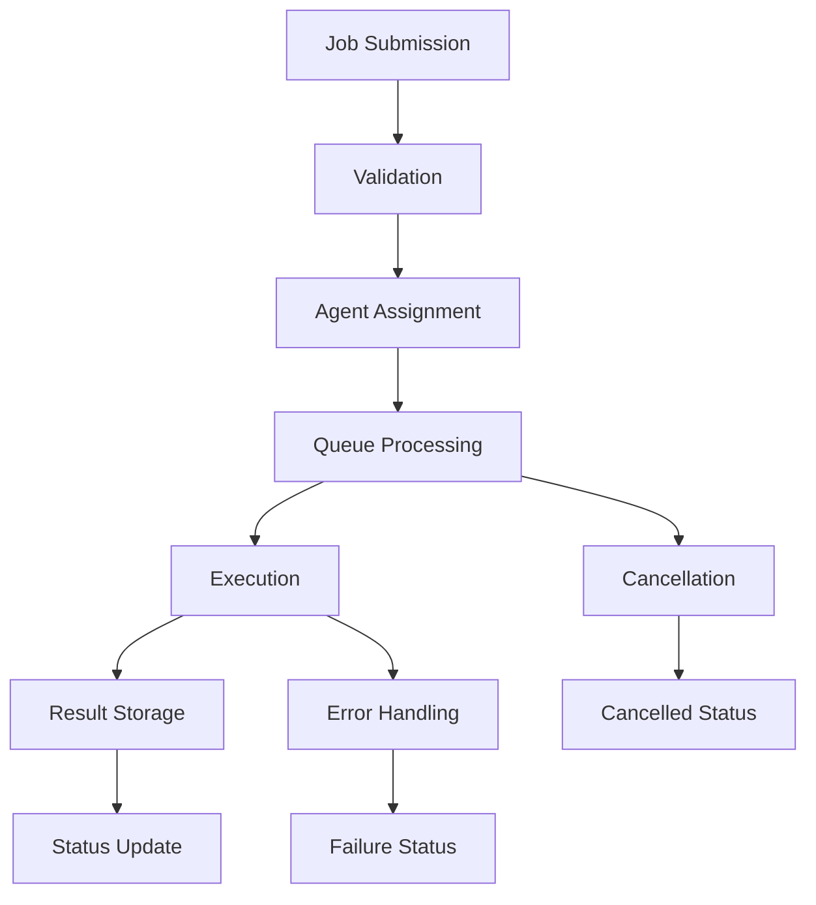

# MCP Core - Job Orchestration Server

A lightweight, extensible job orchestration server that serves as the backbone for distributed, agent-driven projects such as ML experiment trackers and financial backtesters.

## 🚀 Features

- **Job Lifecycle Management**: Submit, monitor, and retrieve results from distributed jobs
- **Agent/Plugin Registry**: Pluggable architecture for domain-specific job handlers
- **Async Processing**: Built on Python asyncio for efficient concurrent execution
- **CLI & API Interfaces**: Command-line tools and programmatic API access
- **Comprehensive Logging**: Structured logging with job tracking and error reporting
- **Type Safety**: Full type hints and Pydantic models for robust data validation
- **Extensible Design**: Easy integration with cloud/distributed frameworks

## 📋 Quick Start

### Installation

```bash
# Clone the repository
git clone <repository-url>
cd MCP_Server_Core

# Create virtual environment
python3 -m venv venv
source venv/bin/activate

# Install dependencies
pip install -r requirements.txt
```

### Basic Usage

```bash
# List registered agents
python -m mcp_core.api.cli agents

# Submit an ML experiment job
python -m mcp_core.api.cli submit --type ml_experiment --config '{"model": "linear", "dataset": "iris", "epochs": 10}'

# Check job status
python -m mcp_core.api.cli status --job-id <job_id>

# List all jobs
python -m mcp_core.api.cli list-jobs

# Cancel a running job
python -m mcp_core.api.cli cancel --job-id <job_id>
```

### Programmatic Usage

```python
import asyncio
from mcp_core.mcp_server import get_server
from mcp_core.jobs.job_schema import JobSubmission, JobType

async def main():
    # Get server instance
    server = get_server()
    
    # Submit a job
    job_submission = JobSubmission(
        type=JobType.ML_EXPERIMENT,
        payload={"model": "neural", "dataset": "mnist", "epochs": 5}
    )
    
    job_id = await server.submit_job(job_submission)
    print(f"Job submitted: {job_id}")
    
    # Monitor job status
    while True:
        status = await server.get_job_status(job_id)
        print(f"Status: {status.status}")
        
        if status.status in ["completed", "failed", "cancelled"]:
            if status.result:
                print(f"Result: {status.result}")
            break
        
        await asyncio.sleep(1)

asyncio.run(main())
```

## 🏗️ Architecture

### Core Components

```
MCP Core
├── Job Management
│   ├── Job submission & validation
│   ├── Status tracking & monitoring
│   ├── Result storage & retrieval
│   └── Job cancellation & cleanup
├── Agent Registry
│   ├── Dynamic agent discovery
│   ├── Job type routing
│   ├── Agent lifecycle management
│   └── Error handling & fallbacks
├── Execution Engine
│   ├── Async job processing
│   ├── Concurrent execution
│   ├── Resource management
│   └── Distributed execution hooks
└── API Layer
    ├── CLI interface
    ├── REST API (planned)
    ├── WebSocket support (planned)
    └── SDK integration
```

### Job Lifecycle



## 🔧 Development

### Project Structure

```
mcp_core/
├── __init__.py
├── mcp_server.py          # Main orchestrator
├── jobs/
│   ├── __init__.py
│   └── job_schema.py      # Job models & enums
├── agents/
│   ├── __init__.py
│   ├── base_agent.py      # Abstract agent class
│   ├── ml_agent.py        # ML experiment agent
│   └── backtest_agent.py  # Financial backtest agent
├── api/
│   ├── __init__.py
│   └── cli.py             # CLI interface
├── utils/
│   ├── __init__.py
│   └── logger.py          # Logging utilities
└── tests/
    ├── __init__.py
    └── test_core.py        # Unit tests
```

### Running Tests

```bash
# Run all tests
python -m pytest tests/ -v

# Run specific test file
python -m pytest tests/test_core.py -v

# Run with coverage
python -m pytest tests/ --cov=mcp_core --cov-report=html
```

### Demo Script

```bash
# Run the demo to see MCP Core in action
python demo.py
```

## 🤖 Creating Custom Agents

### Example Agent Implementation

```python
from mcp_core.agents.base_agent import BaseAgent
from mcp_core.jobs.job_schema import Job, JobType
from typing import Dict, Any

class CustomAgent(BaseAgent):
    """Custom agent for specific domain tasks."""
    
    def get_supported_job_types(self) -> list[JobType]:
        return [JobType.GENERIC]  # or custom job type
    
    async def execute(self, job: Job) -> Dict[str, Any]:
        """Execute the job and return results."""
        self.logger.info(f"Processing job {job.id}")
        
        # Your custom logic here
        result = {
            "status": "success",
            "data": job.payload,
            "processed_at": datetime.utcnow().isoformat()
        }
        
        return result
    
    async def validate_job(self, job: Job) -> bool:
        """Validate job parameters."""
        # Custom validation logic
        return await super().validate_job(job)

# Register the agent
from mcp_core.agents.base_agent import AgentRegistry
AgentRegistry.register(JobType.GENERIC, CustomAgent)
```

## 📊 Supported Job Types

### ML Experiment Jobs

```json
{
  "type": "ml_experiment",
  "payload": {
    "model": "linear|neural|svm",
    "dataset": "iris|mnist|cifar10",
    "epochs": 10,
    "learning_rate": 0.001,
    "batch_size": 32
  },
  "metadata": {
    "user": "researcher",
    "experiment_name": "baseline_model"
  }
}
```

### Backtest Jobs

```json
{
  "type": "backtest",
  "payload": {
    "strategy": "momentum|mean_reversion|arbitrage",
    "ticker": "AAPL|GOOGL|MSFT",
    "start_date": "2023-01-01",
    "end_date": "2023-12-31",
    "initial_capital": 100000,
    "commission": 0.001
  },
  "metadata": {
    "user": "quant",
    "strategy_version": "v2.1"
  }
}
```

## 🔌 Integration with Downstream Apps

### ML Experiment Tracker Integration

```python
from mcp_core.mcp_server import get_server
from mcp_core.jobs.job_schema import JobSubmission, JobType

class MLExperimentTracker:
    def __init__(self):
        self.mcp_server = get_server()
    
    async def run_experiment(self, config):
        """Submit ML experiment to MCP Core."""
        job_submission = JobSubmission(
            type=JobType.ML_EXPERIMENT,
            payload=config
        )
        
        job_id = await self.mcp_server.submit_job(job_submission)
        return job_id
    
    async def get_results(self, job_id):
        """Retrieve experiment results."""
        status = await self.mcp_server.get_job_status(job_id)
        return status.result
```

### Quantitative Backtester Integration

```python
class QuantitativeBacktester:
    def __init__(self):
        self.mcp_server = get_server()
    
    async def run_backtest(self, strategy_config):
        """Submit backtest to MCP Core."""
        job_submission = JobSubmission(
            type=JobType.BACKTEST,
            payload=strategy_config
        )
        
        job_id = await self.mcp_server.submit_job(job_submission)
        return job_id
```

## 🚀 Extending for Production

### Cloud Integration Points

The MCP Core is designed with extensibility in mind. Key integration points for production deployment:

1. **Distributed Execution**: Replace local async processing with Celery, Dask, or Ray
2. **Job Persistence**: Add database storage for job state persistence
3. **Message Queues**: Integrate with Redis, RabbitMQ, or Apache Kafka
4. **Monitoring**: Add Prometheus metrics and Grafana dashboards
5. **Authentication**: Implement API key or OAuth2 authentication
6. **Scaling**: Deploy with Docker and Kubernetes

### Example Production Extensions

```python
# Database persistence
class DatabaseJobStore:
    async def save_job(self, job: Job):
        # Save to PostgreSQL/MongoDB
        pass

# Distributed execution
class CeleryExecutor:
    async def execute_job(self, job: Job):
        # Submit to Celery workers
        pass

# Message queue integration
class RedisQueue:
    async def enqueue_job(self, job: Job):
        # Add to Redis queue
        pass
```

## 📈 Performance & Monitoring

### Logging

MCP Core provides structured logging for monitoring and debugging:

```python
# Enable JSON logging
from mcp_core.utils.logger import setup_logging
setup_logging(level="INFO", json_format=True)

# Custom log events
from mcp_core.utils.logger import log_job_event
log_job_event(logger, job_id, "custom_event", {"metric": "value"})
```

### Metrics

Key metrics to monitor in production:

- Job submission rate
- Job completion rate
- Average execution time
- Error rates by job type
- Agent utilization
- Queue depth

## 🤝 Contributing

1. Fork the repository
2. Create a feature branch
3. Add tests for new functionality
4. Ensure all tests pass
5. Submit a pull request

## 📄 License

This project is licensed under the MIT License - see the LICENSE file for details.

## 🙏 Acknowledgments

- Built with Python asyncio for high-performance async processing
- Uses Pydantic for robust data validation
- Inspired by modern job orchestration systems like Celery and Ray
- Designed for integration with ML and quantitative finance workflows

---

**MCP Core** - Powering distributed, agent-driven applications with modern Python async architecture.